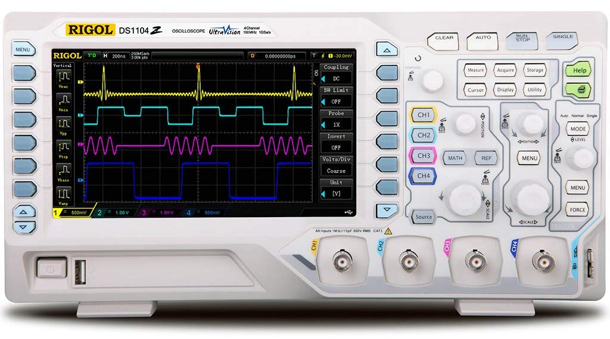
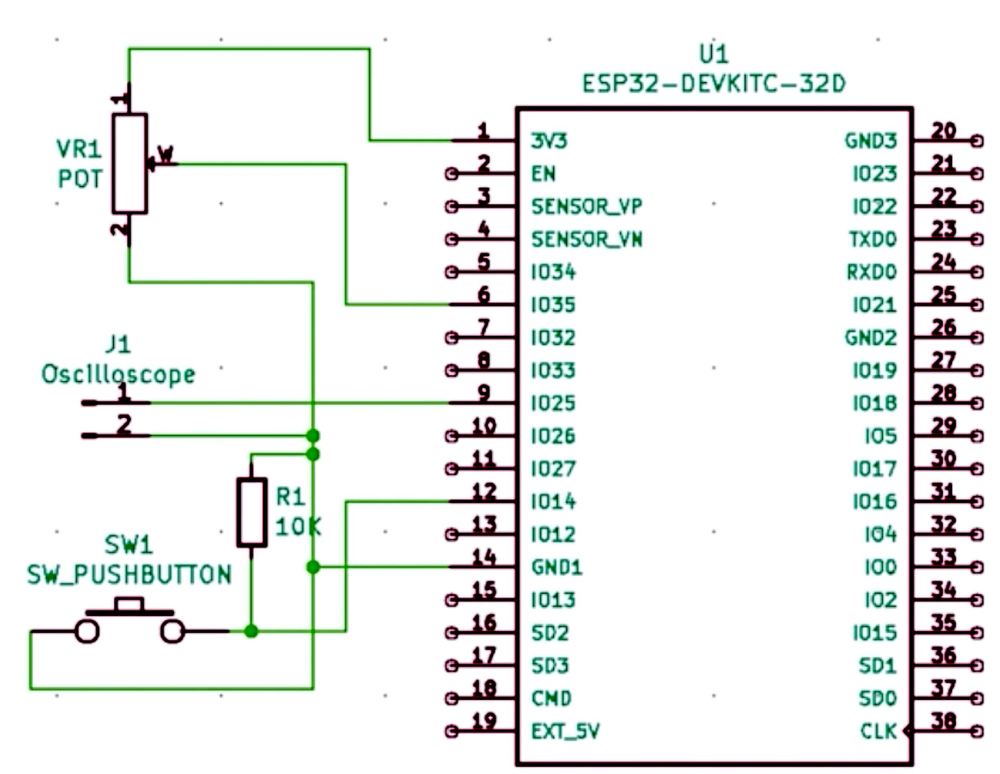

# Oscilloscope and Signal Generator with ESP32 MCU
Oscilloscope for different waveforms analysis    
  

## ESP32 Function Block Diagram  

   
Learn More: https://www.espressif.com/sites/default/files/documentation/esp32_datasheet_en.pdf

## Breadboard    
   
## Schema  
   
## Wave Calculated from  
 https://daycounter.com/Calculators/Sine-Generator-Calculator.phtml    

