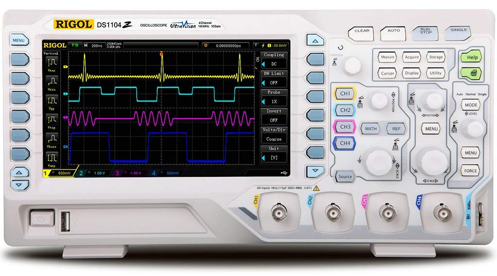
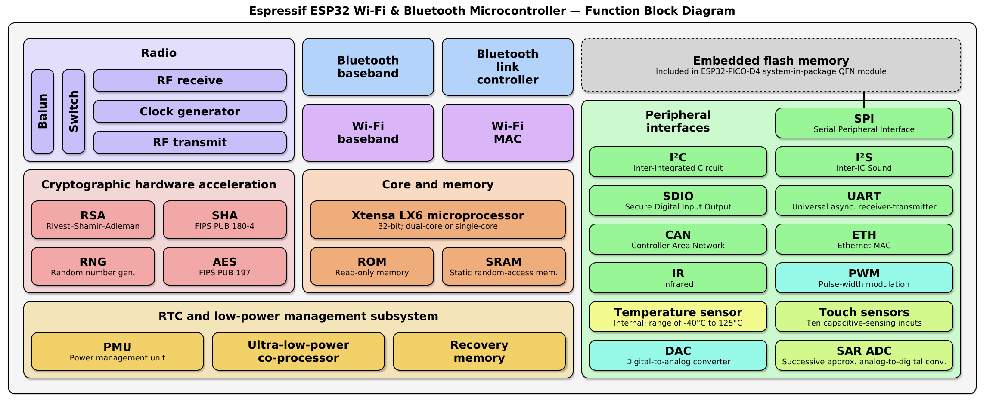
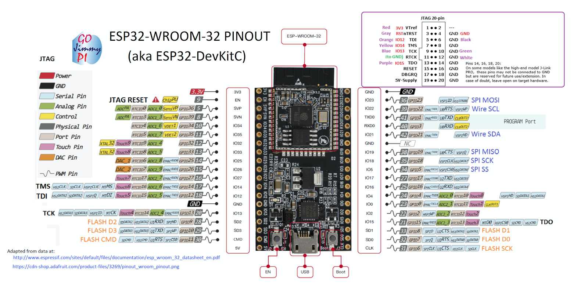
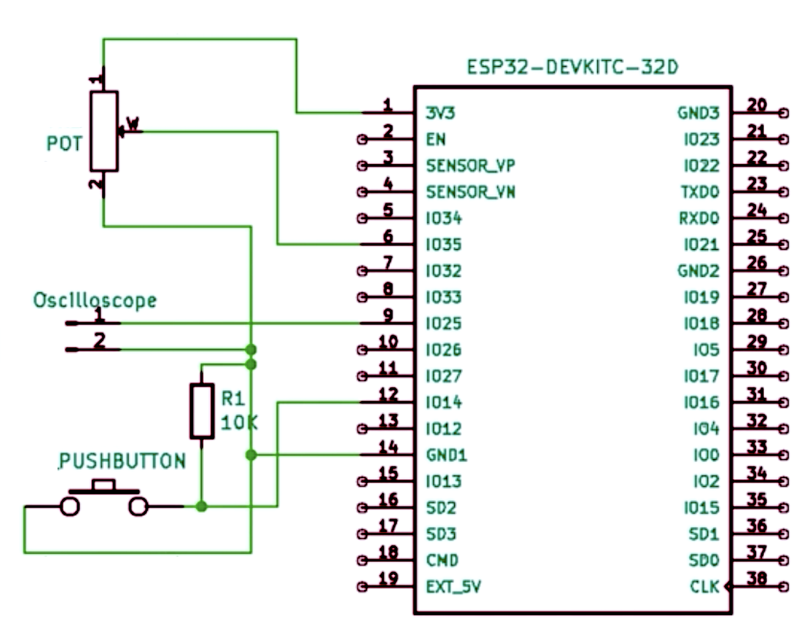

# 1. Oscilloscope and Signal Generator with ESP32 MCU
Oscilloscope for different waveforms analysis    
  

## 2. ESP32 Function Block Diagram  

   
  More: https://www.espressif.com/sites/default/files/documentation/esp32_datasheet_en.pdf

## 3. Breadboard    
  
  

## 4. Pins  
 
 
## 5. Schema  
   

## 6. Wave Calculated from  
 https://daycounter.com/Calculators/Sine-Generator-Calculator.phtml  

